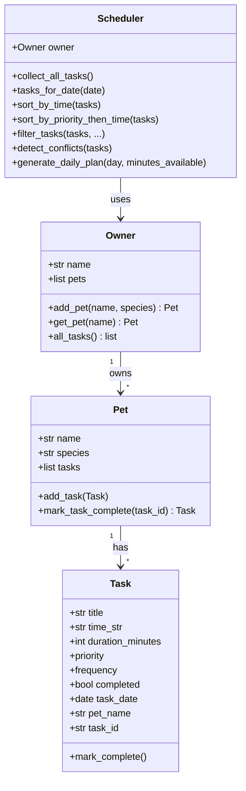

# PawPal+ (Module 2 Project)

**PawPal+** is a Streamlit app that helps a pet owner plan care tasks for their pet(s). This repo implements the full logic layer in `pawpal_system.py`, a CLI demo in `main.py`, and a browser UI in `app.py`.

Fork / upstream: [ai110-module2show-pawpal-starter](https://github.com/MoLCFC/ai110-module2show-pawpal-starter).

## Features

- **Owner & pets**: Register an owner and multiple pets with species.
- **Tasks**: Each task has a title, start time (`HH:MM`), duration, priority (`low` / `medium` / `high`), frequency (`once` / `daily` / `weekly`), and a calendar date.
- **Scheduling**: `Scheduler` collects tasks, sorts by **priority then time**, filters by pet or completion, and builds a **daily plan** with short rationale strings.
- **Recurring tasks**: Marking a `daily` or `weekly` task complete appends the next occurrence (next day or next week).
- **Conflict detection**: Same calendar date + same start time across any pets produces a **warning** (exact-time check; does not model overlapping durations).

## Architecture (UML)



Export this diagram from the [Mermaid Live Editor](https://mermaid.live) as `uml_final.png` if your course requires a PNG artifact.

## Smarter Scheduling

| Capability | Behavior |
|------------|----------|
| **Sort by time** | Orders tasks by `HH:MM` using minutes-from-midnight. |
| **Priority + time** | High tasks before medium before low; ties broken by earlier time. |
| **Filtering** | Optional filter by `completed` and/or `pet_name`. |
| **Recurrence** | `mark_task_complete` on a pet clones the next `daily`/`weekly` instance. |
| **Conflicts** | Warns when two or more tasks share the same **date and start time** (lightweight; no overlap-by-duration). |
| **Daily budget** | If total duration exceeds “minutes available,” the plan adds a warning. |

## Getting started

### Setup

```bash
python -m venv .venv
# Windows:
.venv\Scripts\activate
pip install -r requirements.txt
```

### Run the app

```bash
streamlit run app.py
```

### CLI demo (no browser)

```bash
python main.py
```

## Testing PawPal+

```bash
python -m pytest
```

Tests cover: `mark_complete`, adding tasks to a pet, chronological sort, priority+time sort, daily recurrence, conflict detection, filters, and daily plan scope.

**Confidence level:** ⭐⭐⭐⭐ (4/5) — core behaviors are covered; production use would add tests for weekly recurrence edge cases and time parsing errors.

## What you will build (course checklist)

- Let a user enter basic owner + pet info — **done** in `app.py` + `Owner` / `Pet`.
- Let a user add/edit tasks (duration + priority) — **add** in UI; edit can be added later.
- Generate a daily schedule based on constraints and priorities — **`Scheduler.generate_daily_plan`**.
- Display the plan and reasoning — **Streamlit table + expander**.
- Tests for important scheduling behavior — **`tests/test_pawpal.py`**.

## Project layout

| File | Role |
|------|------|
| `pawpal_system.py` | Domain model + `Scheduler` |
| `main.py` | Terminal demo |
| `app.py` | Streamlit UI + `st.session_state` |
| `tests/test_pawpal.py` | `pytest` suite |
| `reflection.md` | Design & AI collaboration notes |

## Suggested workflow (course)

1. Read the scenario and edge cases.
2. Align the UML above with your course template.
3. Extend behavior in `pawpal_system.py` first, verify with `main.py` / `pytest`, then refresh the UI.
